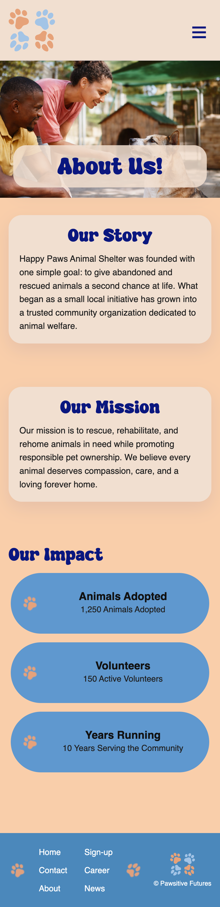
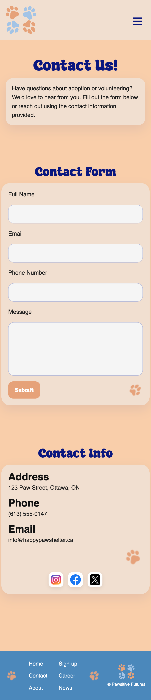
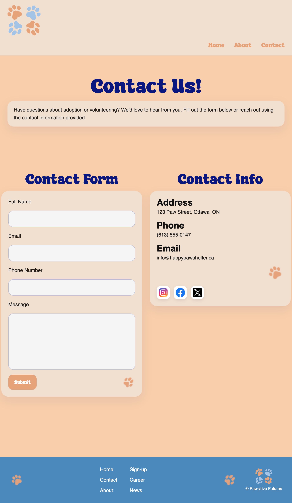
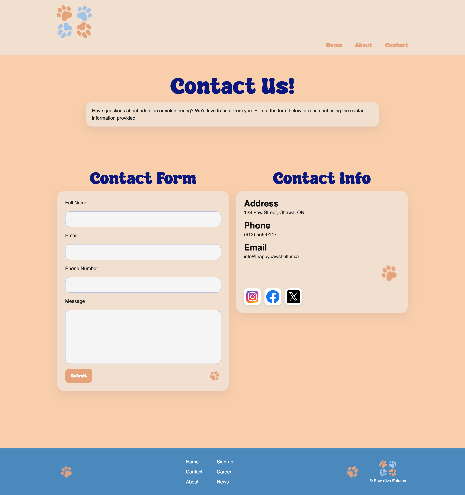

# mtm6201-final

## Project Overview

This project is a responsive animal shelter website called **Happy Paws Animal Shelter**. The goal of the site is to present an inviting and friendly online presence for a shelter that helps animals find loving homes. The website includes three main pages: **Home**, **About**, and **Contact**. Each page was designed to work across mobile, tablet, and desktop screen sizes.

## My Process

My process started with building the general structure of each page in HTML. I focused on creating the main sections first, like the header, hero area, content sections, and footer, before worrying too much about the styling. Once the structure was in place, I moved into CSS and started with mobile-first styling so the site would work well on smaller screens before scaling up to larger ones.

After getting the mobile version working, I added media queries to adjust the layout for tablet and desktop. This included changing navigation styles, moving sections into side-by-side layouts, and reorganizing content like the pet cards and the About page sections so they used the extra screen space better.

I also spent time making the site feel more polished by adding hover states, focus states, button styles, shadows, rounded cards, and a more consistent visual hierarchy. My goal was to make the design feel friendly and playful, while still being clear and easy to use.

## Challenges I Faced

One of the biggest challenges I faced was getting the responsive layouts to look good at all breakpoints. A layout that looked fine on mobile would sometimes look awkward or broken on tablet or desktop. For example, the featured pet cards became too narrow at one point, and the header also caused issues when it was behaving differently across screen sizes.

Another challenge was working with images. Some of the images looked blurry when stretched too large, especially in hero sections and larger content cards. I had to replace some assets and adjust image sizing with CSS using properties like `object-fit` so they filled their containers properly without getting distorted.

I also had to fix layout conflicts between my custom CSS and some Bootstrap classes. At one point, some of the grid behavior was fighting against the styles I was trying to apply manually. I had to simplify a few parts and rely more on my own CSS grid and flexbox layout decisions.

## How I Overcame Those Challenges

I overcame these problems by testing the site constantly at different screen sizes and fixing one section at a time instead of trying to fix everything at once. Breaking the problems down made it easier to see what was actually causing the issue.

For the responsive layout issues, I adjusted my media queries and made sure each breakpoint had styles that actually made sense for that screen size instead of just stretching the mobile version. For the image issues, I swapped in better quality assets and controlled the way images displayed with CSS. For layout conflicts, I removed or simplified classes that were getting in the way and made my CSS more intentional.

I also learned that sometimes the best fix is not the fanciest one. In a few cases, trying to make something more advanced actually made the layout worse, so simplifying the structure gave me a cleaner result.

## What I Learned

By creating this project, I learned a lot more about responsive design and how important it is to test layouts across multiple breakpoints instead of assuming they will automatically work. I also got more comfortable using **Flexbox**, **CSS Grid**, spacing, layering, and reusable styling patterns to create a more consistent design.

### Below is a list of assets, libraries, and resources used in this project that were not originally my own:

- **Bootstrap 5.3**
  - Used for responsive support and layout helpers
  - Link: `https://cdn.jsdelivr.net/npm/bootstrap@5.3.0/dist/css/bootstrap.min.css`

- **Bootstrap JavaScript Bundle**
  - Used to support Bootstrap functionality if needed
  - Link: `https://cdn.jsdelivr.net/npm/bootstrap@5.3.0/dist/js/bootstrap.bundle.min.js`

- **Fonts**
  - `Super Dream`
  - `Sunflower`
  - Used for the heading and body text styling in the design

- **Images**
  - All Images are from adobe Stock.
  - Social media icons used on the Contact page
    - <a href="https://www.flaticon.com/free-icons/facebook" title="facebook icons">Facebook icons created by Freepik - Flaticon</a>
    - <a href="https://www.flaticon.com/free-icons/instagram" title="instagram icons">Instagram icons created by cobynecz - Flaticon</a>
    - <a href="https://www.flaticon.com/free-icons/tweet" title="tweet icons">Tweet icons created by Freepik - Flaticon</a>

## Wireframes

- **Home page**
  - 
  - 
  - 

- **About page**
  - 
  - 
  - 

- **Contact page**
  - 
  - 
  - 
